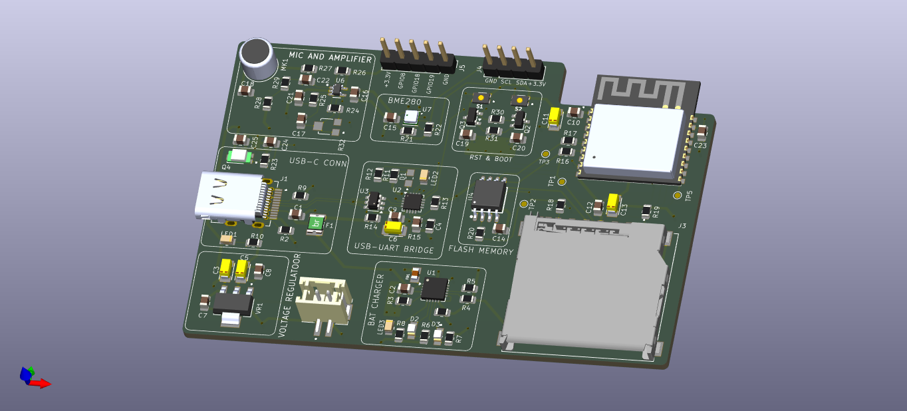
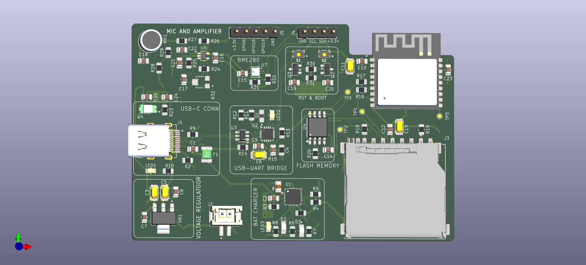
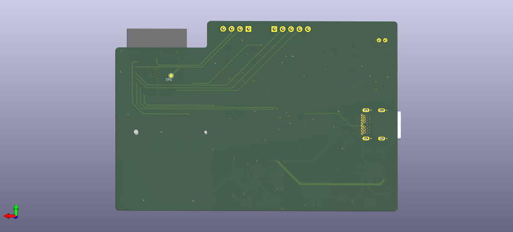

# Custom ESP32-C3 Development Board

## Overview
This repository contains the KiCad PCB design files for a custom development board powered by the ESP32-C3 microcontroller. This board integrates essential environmental sensing, audio input, and power management features. It serves as a robust hardware foundation for developing advanced embedded systems and IoT devices.

## Hardware Features

* **Microcontroller**: Powered by the ESP32-C3-WROOM-02-H4 module, offering Wi-Fi and Bluetooth LE connectivity[cite: 203].
* **Power Management**: 
    * Modern USB-C connector interface[cite: 2].
    * Onboard 3.3V voltage regulation via the LM1117MPX-3.3 LDO[cite: 35].
    * Integrated LiPo battery charging circuit utilizing the MCP73871 IC[cite: 51, 55].
* **USB-to-UART Interface**: Features the CP2102N bridge for reliable serial communication and seamless flashing[cite: 122, 186].
* **Memory & Storage**:
    * External 32Mb (4MB) W25Q32JVSSIQ Flash memory[cite: 163, 169].
    * Dedicated MicroSD card circuit for extensive data logging[cite: 244].
* **Integrated Sensors**:
    * **BME280**: Environmental sensor for capturing temperature, humidity, and barometric pressure data[cite: 306, 311].
    * **TEMT6000**: Ambient light sensor for environmental illumination tracking[cite: 340, 345].
    * **Audio**: Electret microphone (CMC-5042PF-AC) paired with a MAX4466EXK operational amplifier for high-quality audio input[cite: 320, 323, 359].
* **User Interface & Expansion**:
    * Auto-program circuitry equipped with standard Boot and Reset tactile buttons[cite: 405, 406].
    * Dedicated I2C connector optimized for OLED displays[cite: 388, 389].
    * Accessible remaining GPIO breakout headers for rapid prototyping[cite: 392, 398].

## Visuals & Documentation

### Top View

### Bottom View Routing

### Schematic
The complete circuit design can be viewed here: [Schematic PDF](media/Shematic.pdf)

